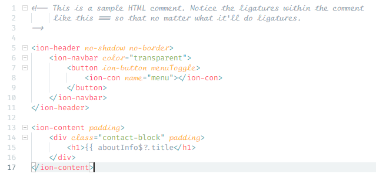
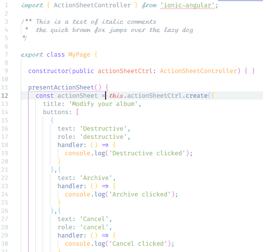

# The New Fira Code iScript 
Fira Code iScript is a font hybrid with ligatures as well as a nice cursive style font for italics, allowing a distinct visual difference for keywords and comments (with appropriate style theme applied). I later also created a similar font hybrid with a more-readible script font that you can find [here](https://github.com/XMLDiva/FiraCodemScript).

The regular and bold fonts (and where the ligatures are from) are from [Fira Code](https://github.com/tonsky/FiraCode); the italic is from [Script12](https://www.myfontsfree.com/134618/script12pitchbt.htm).

## Updated from Original
Here's what's changed from the origianl Fira Code iScript.

#### Italic
The meta data has been tweeked so that more applications recognize the italic font (it previously wasn't marked as italic).

#### Spacing
The font is now correctly monospaced and is a matching width to Fira Code

#### New Characters
I'm really picky so I didn't like the following characters.

#### Update Fira Code 1.205
This was the latest Fira Code font that I've updated to. Thanks @tonsky !

## Installation
Download the distribution folder and install the ttf fonts in there. Make sure you have an editor theme that supports both italics and ligature. Finally, in your editor, set the font to 'Fira Code iScript' and set ligatures to true.

## Original Code
This is all based on the original Fira Code iScript. Thanks @kencrocken !
